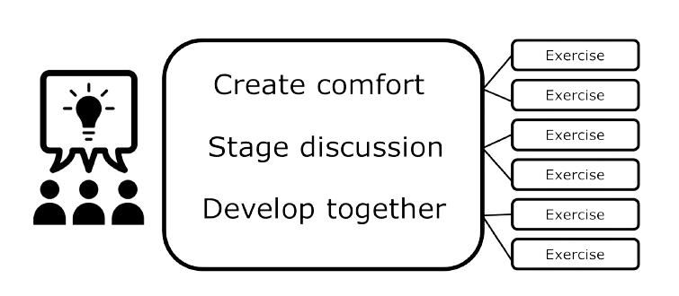

- [ ] Use the room
- [ ] Use Templates for gathering data
- [ ] Methods: Balance amount and complexity
- [ ] Have a visible agenda
- [ ] Make intro and outro
- [ ] Inform about previous outcomes
- [ ] Use Boundary Objects 
- [ ] Stage the workshop
- [ ] Remember to add breaks
- [ ] Consider your audience
- [ ] Respect the timeframes
- [ ] Use Gamification
- [ ] Be prepared in advance
- [ ] Gather the needed equipment in advance
- [ ] Bring snacks!